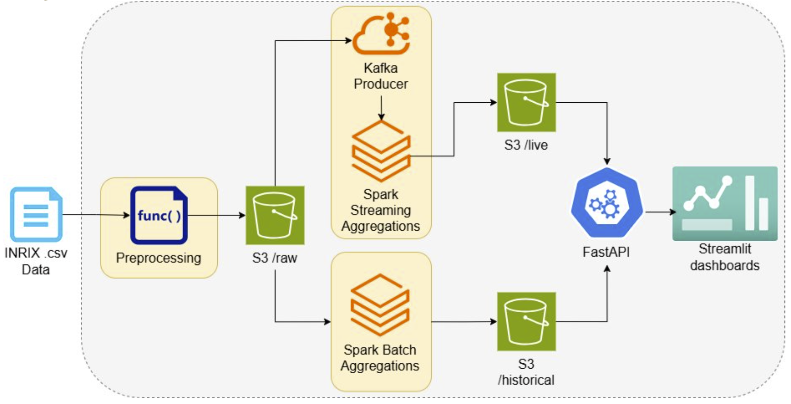
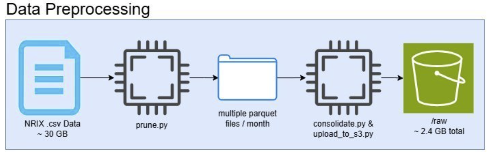
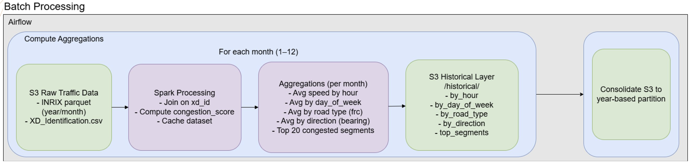
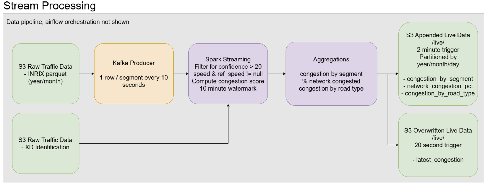

# Traffic Pipeline

End-to-end traffic analytics project for Davidson County using INRIX data.

## What This Project Has

| Pipeline | Purpose | Main Script | Output |
|---|---|---|---|
| Preprocessing | Convert raw CSV into partitioned Parquet and upload to S3 | `preprocessing-scripts/*.py` (local), mirrored in `airflow/scripts/*.py` for DAG tasks | `s3://ndot-traffic-pipeline/raw/...` |
| Streaming | Replay time slices to Kafka and compute live Spark metrics | `producer/producer.py` + `spark/streaming_job.py` | `s3://ndot-traffic-pipeline/live/...` |
| Batch | Run historical aggregations with Spark | `spark/spark_batch.py` (local), mirrored in `airflow/scripts/spark_batch.py` for DAG tasks | `s3://ndot-traffic-pipeline/historical/...` |

---

## Architecture At A Glance



```text
Local INRIX CSV
  -> prune.py + consolidate_parquet.py
  -> local parquet partitions (year/month)
  -> upload to S3 raw/

Streaming branch:
S3 raw/ -> producer.py -> Kafka topic road-segments -> streaming_job.py
-> S3 live/{congestion_by_segment, network_congestion_pct, congestion_by_road_type}
-> S3 live/checkpoints/*

Batch branch:
S3 raw/ + XD_Identification.csv -> spark_batch.py
-> S3 historical/*
```

---

## Repository Layout

- `producer/` - Kafka producer + debug consumer image
- `spark/` - Spark Structured Streaming app image
- `airflow/dags/` - orchestration DAGs (`preprocessing_pipeline`, `batch_pipeline`, `streaming_pipeline`)
- `airflow/scripts/` - Airflow task copies/wrappers of preprocessing + batch scripts
- `airflow/` - Airflow image/Dockerfile
- `streamlit/` - dashboard app
- `api/` - FastAPI service to connect S3 and dashboard
- `docker-compose.yml` - service orchestration for both local and Airflow-driven runs


## Instructions For How to Run
#### Setup and Dependencies
Required
- Docker Desktop + Docker Compose
- An AWS S3 Bucket with 3 empty folders: `/live`, `/historical`, and `/raw`
- AWS credentials with access to the S3 bucket
- `.env` in repo root (same level as this file):
  - `AWS_ACCESS_KEY_ID`
  - `AWS_SECRET_ACCESS_KEY`
  - `AWS_SESSION_TOKEN` (if temporary creds)
  - `AWS_REGION`
  - `S3_BUCKET` (name of your S3 bucket, defaults to `ndot-traffic-pipeline` if not present)

- Add 

#### How to get the data
The NRIX data set is available on [box here](https://vanderbilt.app.box.com/s/qbd90obb17kfc9w3m7bdq6s545x4a1wf). Only the `inrix_data/` folder is needed
Preprocessing and creating the historical batch data can take a while, so we've uploaded the resulting parquet files to this [box folder here](https://vanderbilt.box.com/s/5hrcs8lih15m2pwmzu4oy0quhpzlq6m8)

### Starting Airflow
Our entire project is orchestrated via Airflow DAGs. To start up airflow, run `docker compose up airflow-webserver`
This command starts every container needed to run airflow correctly
Go to `localhost:8080` after seeing the log mesage "Listening at: http://0.0.0.0:8080"
Log in using the username `admin` and password `admin`

#### Preprocessing
To run the preprocessing DAG, create a folder called `data/` in the project root. Add `Davidson-2023-2024-for-NDOT-10-min-Ave.csv` to `data/` (see above for the link to download from Box). Additionally, add `XD_identification.csv` to the S3 bucket `/raw`

Start airflow and log-in using the directions above and then start the DAG called `preprocessing-pipeline`
This pipeline runs through 3 scripts that process and upload the data to an S3 bucket. Because the original data is ~524,000,000 rows, this can take some time, on my laptop it takes ~10 minutes.



### Batch processing
To run the batch processing DAG, start airflow using the directions above and start the DAG called `batch-pipeline`. The batch processing creates 5 aggregations:
1. **By hour of day** — average speed and congestion score for each hour (0–23), grouped by year and month
2. **By day of week** — average speed and congestion score for each day (1–7, Sunday = 1), grouped by year and month
3. **By road type** — average speed and congestion score per FRC road classification, grouped by year and month
4. **By direction** — average speed and congestion score per bearing, grouped by year and month
5. **Top 20 worst segments** — the 20 road segments with the highest average congestion score, grouped by year and month

This process takes the longest of any part of the project due to the sheer amount of data. It uses 3 Spark workers each with 1 core and 2 GB memory. To adjust this amount, go to [spark/spark_batch.py](spark/spark_batch.py) and modify the `spark.executor.instances`, `spark.executor.cores`, and `spark.executor.memory` configs. On my laptop it takes ~45 minutes to fully complete. Because of this, we've uploaded the files that are outputted by the batch processing to this Box link HERE

This uses the approach of going over each month and calculating the aggregations and then consolidating each month's aggregations into 1 parquet file/year. This ensures that 1. there is enough memory space for spark to do each aggregation and 2. There aren't tons of small files that all require a GET request from the frontend. It is better to spend more time having to do the consolidation than 12x-ing the number of API calls needed because the consolidation only needs to happen once compared to 12 extra calls for each aggregation every time the dashboard is loaded. 



### Stream processing
To run the stream processing DAG, start airflow using the directions above and start the DAG called `streaming-pipeline`. IMPORTANT: before running make sure that you have an empty `/live` folder in your S3 bucket. To change the date/time range as well as the rate at which the producer runs, update the command in `airflow/dags/streaming_dag.py` for the `run-producer` BashOperator. The defualt is for the producer to emit 1 row of data / road segment every 10 seconds. 

In order to see the dashboard to vizualize the batch/stream processing, run `docker compose up streamlit api`. The dashboard is hosted on `localhost:8501`. It will take some time for the live data to become visible due to the overhead of starting kafka, spark, running the aggregations, and writing the results to S3. FastAPI uses a daemon to fetch the latest live data from `live/latest_congestion_by_segment` based on the `LIVE_REFRESH_INTERVAL` constant in `api/main.py`. These results are cached and then fetched by the dashboard when it automatically reloads every 10 seconds. 



### Local vs Airflow execution model (important)

- **Local/manual runs**: you execute `docker compose ...` from your terminal at repo root.
- **Airflow runs**: the DAG executes `docker compose ...` from inside `/opt/airflow/repo` (mounted repo) via `/var/run/docker.sock`.
- Because of that, this repo intentionally separates some behavior:
  - `producer-app` and `spark-app` rely on image builds (`--build`) instead of source bind mounts, so DAG runs are deterministic.
  - `kafka-consumer` keeps a source bind mount for local debugging convenience only.

---

## Prerequisites

## Dependencies

### Docker images (`docker-compose.yml`)

- `confluentinc/cp-zookeeper:7.6.0`
- `confluentinc/cp-kafka:7.6.0`
- `apache/spark:3.5.0` (master/worker)
- custom Spark app image from `spark/Dockerfile`
- `apache/airflow:2.10.3`
- `postgres:13`
- `python:3.10-slim` (producer + streamlit base)

---

## Airflow Usage

Use these commands from repo root.

1. Start Airflow (postgres, init, scheduler, and webserver all start automatically):

```powershell
docker compose up -d airflow-webserver
```

2. Open Airflow UI:
   - URL: [http://localhost:8080](http://localhost:8080)
   - Login: `admin` / `admin`

5. You should see three DAGs:
   - `preprocessing_pipeline`
   - `batch_pipeline`
   - `streaming_pipeline`

Notes:

- `streaming_pipeline` runs docker compose commands from inside Airflow (`/opt/airflow/repo`).
- For streaming tasks, DAG commands rebuild app images (`spark-app`, `producer-app`) so code changes are picked up.

---

## Tuning And Configuration

### Kafka topic partitions

Topic partition count is configured as a command line argument passed to Kafka in `airflow/dags/streaming_day.py`

### Spark shuffle partitions

Configured in `spark/streaming_job.py`:

```python
.config("spark.sql.shuffle.partitions", "8")
```

This controls Spark shuffle parallelism for joins/groupBy/window aggregations.

Starting point for 16 cores:

- Kafka partitions: `8-16`
- Spark shuffle partitions: `16-32` (common first value: `24`)

### Producer runtime flags

`producer/producer.py` options:

- `--start-time` (required): replay start (ISO)
- `--end-time` (optional): replay end, default end of start year
- `--emit-mode {quiet|verbose}`
- `--slice-delay` (seconds)
- `--run-duration` (seconds)
- `--bucket-minutes` (default `10`)

Example:

```powershell
docker compose exec producer-app python producer.py --start-time 2023-01-01T00:00:00 --end-time 2023-01-01T06:00:00 --emit-mode verbose --slice-delay 1 --bucket-minutes 10
```

---

## Useful Commands

Start full stack (not recommended, better to do `docker compose up airflow-webserver` and `docker compose up api streamlit` seperately):

```powershell
docker compose up --build
```

Stop all running services:

```powershell
docker compose down
```

Stop and remove volumes too (full local reset):

```powershell
docker compose down -v
```

Start streaming-only stack:

```powershell
docker compose up -d zookeeper kafka spark-master spark-worker spark-app producer-app
```

Kafka debug consumer:

```powershell
docker compose up -d kafka-consumer
docker compose logs -f kafka-consumer
```

### Service Endpoints (from `docker-compose.yml`)

- Streamlit UI: [http://localhost:8501](http://localhost:8501)
- Airflow UI (when webserver is running): [http://localhost:8080](http://localhost:8080)
- Kafka broker (client connection): `localhost:9092`
- Spark master web UI: [http://localhost:8081](http://localhost:8081)
- Spark master RPC endpoint (for Spark submit): `spark://localhost:7077`

---
